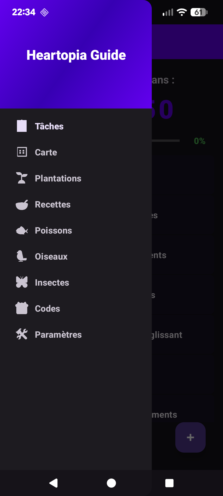
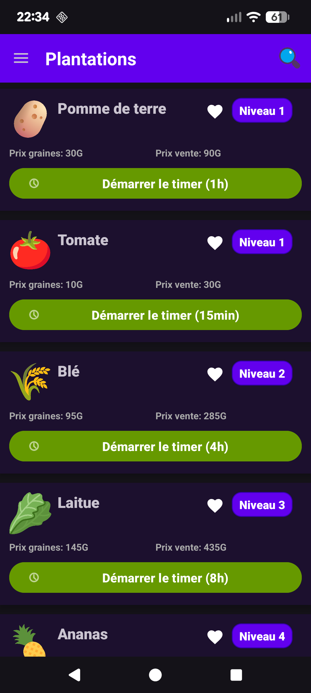
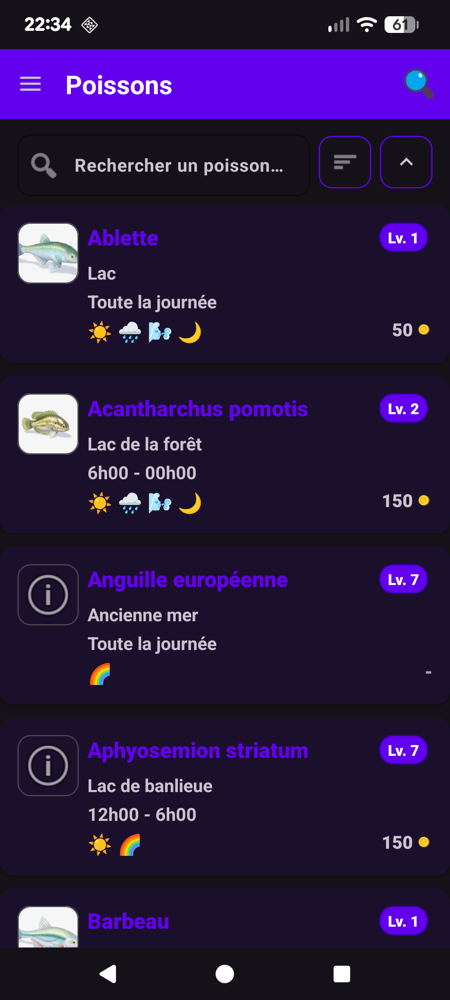
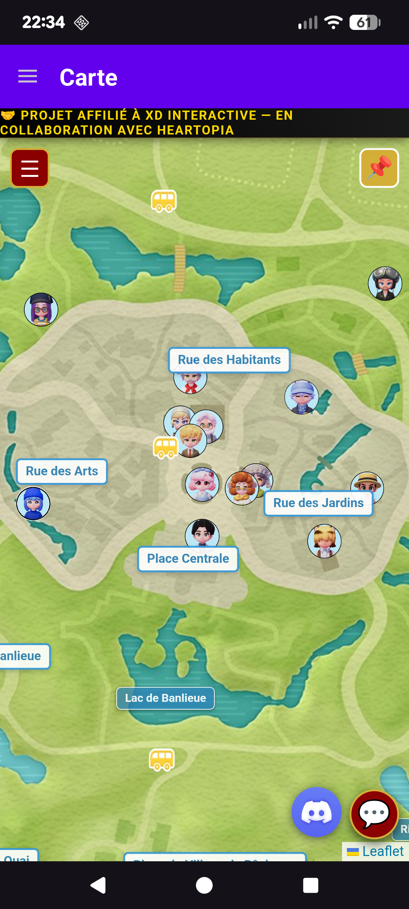

# 🎮 Heartopia Guide

<div align="center">


**Application compagnon Android complète pour le jeu Heartopia**

</div>

---

## 📖 À propos

**Heartopia Guide** est une application Android gratuite et open-source conçue pour améliorer l'expérience de jeu dans **Heartopia**. L'application centralise toutes les informations essentielles et propose des outils pratiques pour optimiser votre gameplay.

### ✨ Points forts

- 🎯 **Gestion complète des timers** de plantations avec notifications
- 📚 **Encyclopédies complètes** : Recettes, Poissons, Oiseaux, Insectes
- 🗺️ **Carte interactive** intégrée (Maptopia)
- ✅ **Suivi des tâches quotidiennes** avec réinitialisation automatique
- 🎁 **Codes promo** directement accessibles
- 🌙 **Mode sombre/clair** et support multilingue (FR/EN)
- 💾 **Fonctionne hors ligne** pour la plupart des fonctionnalités

---

## 🎯 Fonctionnalités

### 🏠 Tâches Quotidiennes
- Compteur jusqu'à la réinitialisation quotidienne (6h)
- Liste de 7 tâches prédéfinies
- Ajout de tâches personnalisées
- Barre de progression visuelle

### 🌱 Plantations
- Gestion de **7 cultures** avec timers individuels
- Notifications automatiques à la récolte
- Application d'engrais pour accélérer la croissance
- Bannière informative avec timers actifs
- Système de favoris
- Fonctionnement en arrière-plan

### 🍳 Recettes
- Catalogue de **100+ recettes**
- Images et ingrédients détaillés
- Filtres par nom, prix ou énergie
- Système de favoris

### 🐟 Poissons | 🐦 Oiseaux | 🪲 Insectes
- Encyclopédies complètes avec images
- Informations détaillées (habitat, niveau, prix, météo)
- Filtres et tri avancés
- Zoom sur les images

### 🗺️ Carte Interactive
- Intégration WebView de Maptopia
- Navigation fluide et zoom

### 🎁 Codes Promo
- Accès direct au site officiel des codes
- Navigation intégrée

### ⚙️ Paramètres
- Sélection de langue (FR/EN)
- Thème clair/sombre

---

## 📸 Captures d'écran

<div style="display: flex; flex-wrap: wrap; justify-content: space-between;">
    <div>
        
    </div>
    <div>
        
    </div>
    <div>
        
    </div>
    <div>
        
    </div>
</div>


---

### Langages & Frameworks
- **Kotlin** 2.3.0 - Langage de programmation principal
- **Java** 17 - Compatibilité

### Architecture & Patterns
- **MVVM** (Model-View-ViewModel) - Architecture de l'application
- **LiveData** - Observation réactive des données
- **ViewModel** - Gestion du cycle de vie des données

### Bibliothèques principales
- **AndroidX** - Bibliothèques Android modernes
  - `lifecycle-viewmodel-ktx` - ViewModel avec support Kotlin
  - `lifecycle-livedata-ktx` - LiveData avec support Kotlin
  - `navigation-fragment-ktx` - Navigation entre fragments
  - `room-runtime` - Base de données locale
  - `work-runtime-ktx` - Tâches en arrière-plan
- **Material Design 3** - Composants UI modernes
- **Coroutines** - Programmation asynchrone
- **ViewBinding** - Binding des vues

### Outils de développement
- **Room Database** - Persistance locale des timers
- **WorkManager** - Notifications en arrière-plan
- **SharedPreferences** - Stockage des préférences utilisateur

---

## 📁 Architecture

L'application suit l'architecture **MVVM** (Model-View-ViewModel) :

```
app/src/main/java/com/heartopia/timer/
├── data/                          # Couche données
│   ├── Crop.kt                    # Modèle de culture
│   ├── CropRepository.kt          # Repository des cultures
│   ├── Recipe.kt                  # Modèle de recette
│   ├── Bird.kt                    # Modèle d'oiseau
│   ├── Fish.kt                    # Modèle de poisson
│   ├── Bug.kt                     # Modèle d'insecte
│   ├── DailyTasksManager.kt        # Gestion des tâches
│   ├── FavoritesManager.kt         # Gestion des favoris
│   ├── SettingsManager.kt          # Gestion des paramètres
│   └── database/                  # Base de données Room
│       ├── AppDatabase.kt         # Base de données principale
│       ├── TimerDao.kt            # DAO pour les timers
│       └── TimerEntity.kt         # Entité Timer
│
├── ui/                            # Couche présentation
│   ├── MainActivity.kt            # Activité principale
│   ├── HomeFragment.kt           # Fragment des tâches
│   ├── TimerFragment.kt          # Fragment des plantations
│   ├── RecipesFragment.kt        # Fragment des recettes
│   ├── BirdsFragment.kt          # Fragment des oiseaux
│   ├── FishFragment.kt           # Fragment des poissons
│   ├── BugsFragment.kt           # Fragment des insectes
│   ├── CodesFragment.kt          # Fragment des codes
│   ├── MapFragment.kt            # Fragment de la carte
│   ├── SettingsFragment.kt       # Fragment des paramètres
│   └── [Adapters]                 # Adapters RecyclerView
│
├── viewmodel/                     # Couche logique métier
│   ├── CropViewModel.kt          # ViewModel des cultures
│   ├── RecipeViewModel.kt        # ViewModel des recettes
│   ├── BirdViewModel.kt          # ViewModel des oiseaux
│   ├── FishViewModel.kt          # ViewModel des poissons
│   ├── BugViewModel.kt           # ViewModel des insectes
│   ├── SettingsViewModel.kt       # ViewModel des paramètres
│   └── ViewModelFactory.kt        # Factory pour les ViewModels
│
├── worker/                        # Workers en arrière-plan
│   └── TimerNotificationWorker.kt # Worker pour les notifications
│
├── service/                       # Services
│   └── TimerForegroundService.kt  # Service pour les timers
│
├── notification/                  # Notifications
│   └── NotificationHelper.kt      # Helper pour les notifications
│
└── MainApplication.kt             # Application principale
```

### Flux de données

```
User Action → Fragment → ViewModel → Repository → Database/Data
                ↓           ↓
            UI Update ← LiveData
```

---

## 🔐 Permissions

L'application demande les permissions suivantes :

- `POST_NOTIFICATIONS` (Android 13+) - Pour les notifications de timers
- `INTERNET` - Pour la carte interactive et les codes promo
- `VIBRATE` - Pour les notifications avec vibration
- `FOREGROUND_SERVICE` - Pour les timers en arrière-plan

---

## 📝 Structure des données

### Cultures disponibles

| Culture | Temps | Prix graines | Prix vente | Niveau |
|---------|-------|--------------|------------|--------|
| 🍅 Tomate | 15 min | 10G | 30G | 1 |
| 🥔 Pomme de terre | 1h | 30G | 90G | 1 |
| 🌾 Blé | 4h | 95G | 285G | 2 |
| 🥬 Laitue | 8h | 145G | 435G | 3 |
| 🍍 Ananas | 30 min | 15G | 52G | 4 |
| 🥕 Carotte | 2h | 50G | 155G | 5 |
| 🍓 Fraise | 6h | 125G | 375G | 6 |

---

## 📄 Licence

Ce projet est sous licence MIT. Voir le fichier `LICENSE` pour plus de détails.

---

## 🙏 Remerciements

- **Heartopia** - Pour le jeu original
- **Maptopia** - Pour la carte interactive intégrée
- **heartopia.gg** - Pour les codes promo

---

## ⚠️ Disclaimer

Cette application est **non-officielle** et n'est pas affiliée, associée, autorisée, approuvée par ou de quelque manière que ce soit liée aux créateurs officiels de Heartopia. Cette application est créée par des fans pour les fans.

---

<div align="center">

**Fait avec ❤️ pour la communauté Heartopia**

⭐ Si ce projet vous a aidé, n'hésitez pas à mettre une étoile !

</div>
